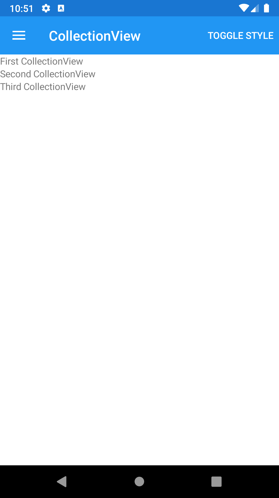





CollectionView
--------
##### `topic last updated: v1.0 - 02.04.2021 - 11:47pm`

displays a scrollable list of selectable data items, using different layout specifications

Please read the Xamarin.Forms documentation to check whether this control is available for the platforms you target.

<br /> 

### Basic example


```fsharp 
View.CollectionView(items = [
    View.Label("First CollectionView")
    View.Label("Second CollectionView")
    View.Label("Third CollectionView")
] )
```



<br /> <br /> 

### Basic example with styling

```fsharp 
View.CollectionView
    (
        horizontalOptions = style.Position,
        verticalOptions = style.Position,
        backgroundColor = style.LayoutColor,
        items = [
            View.Label
                (
                    horizontalOptions = style.Position,
                    verticalOptions = style.Position,
                    backgroundColor = style.ViewColor,
                    padding = style.Padding,  
                    text = ("First CollectionView")
                )
            View.Label
                (
                    horizontalOptions = style.Position,
                    verticalOptions = style.Position,
                    backgroundColor = style.ViewColor2,
                    padding = style.Padding,  
                    text = ("Second CollectionView")
                )
            View.Label
                (
                    horizontalOptions = style.Position,
                    verticalOptions = style.Position,
                    backgroundColor = style.ViewColor3,
                    padding = style.Padding,  
                    text = ("Third CollectionView")
                )
        ] 
    )
```


<br /> <br /> 

See also:

* [`Xamarin.Forms.CollectionView`](https://docs.microsoft.com/en-us/dotnet/api/Xamarin.Forms.CollectionView)


### More examples

