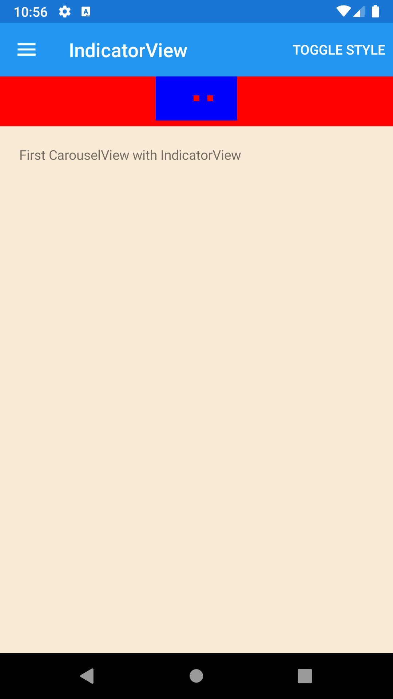





IndicatorView
--------
##### `topic last updated: v1.0 - 02.04.2021 - 11:47pm`

displays indicators that represent the number of items in a CarouselView

<br /> 

### Basic example


```fsharp 
View.StackLayout( children = [
    View.IndicatorView(ref = indicatorRef, indicatorColor = Color.Red, selectedIndicatorColor = Color.Blue, indicatorsShape = IndicatorShape.Square)                    
    View.CarouselView(indicatorView = indicatorRef, items = [ 
        View.Label("First CarouselView with IndicatorView")
        View.Label("Second CarouselView with IndicatorView")
        View.Label("Third CarouselView with IndicatorView")
    ] )
] )
```


<br /> <br /> 

### Basic example with styling

```fsharp 
View.StackLayout
    ( 
        children = [
            View.IndicatorView
                (   
                    horizontalOptions = style.Position,
                    verticalOptions = style.Position,
                    backgroundColor = style.LayoutColor,
                    padding = style.Padding,  
                    ref = indicatorRef, 
                    indicatorColor = Color.Red, 
                    selectedIndicatorColor = Color.Blue, 
                    indicatorsShape = IndicatorShape.Square
                )                    
            View.CarouselView
                (
                    indicatorView = indicatorRef, 
                    items = [
                        View.Label
                            (
                                horizontalOptions = style.Position,
                                verticalOptions = style.Position,
                                backgroundColor = style.ViewColor,
                                padding = style.Padding,  
                                text = ("First CarouselView with IndicatorView")
                            )
                        View.Label
                            (
                                horizontalOptions = style.Position,
                                verticalOptions = style.Position,
                                backgroundColor = style.ViewColor2,
                                padding = style.Padding,  
                                text = ("Second CarouselView with IndicatorView")
                            )
                        View.Label
                            (
                                horizontalOptions = style.Position,
                                verticalOptions = style.Position,
                                backgroundColor = style.ViewColor3,
                                padding = style.Padding,  
                                text = ("Third CarouselView with IndicatorView")
                            )

                    ]    
                )
        ] )
```




<br /> <br /> 

See also:

* [`Xamarin.Forms.IndicatorView`](https://docs.microsoft.com/en-us/dotnet/api/Xamarin.Forms.IndicatorView)