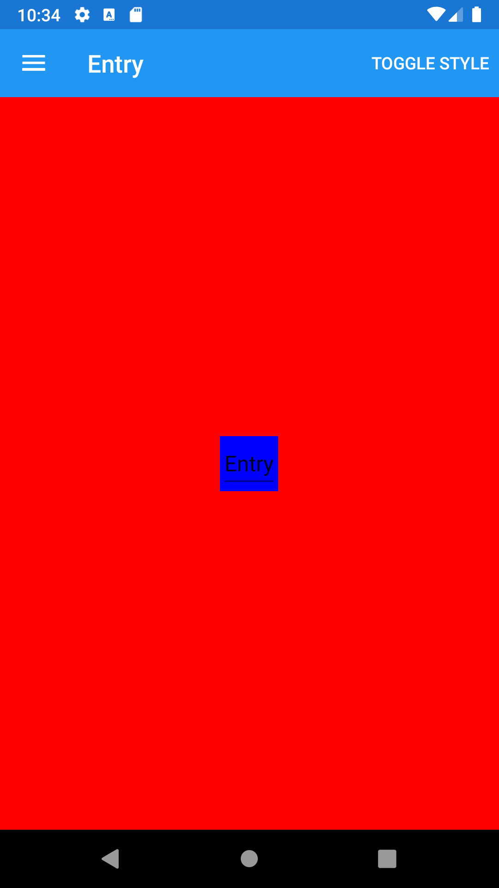





Entry
--------

<br /> 

### Basic example


```fsharp 
View.Entry("Entry")
```


<br /> <br /> 

### Basic example with styling

```fsharp 
View.Entry
    (
        horizontalOptions = style.Position,
        verticalOptions = style.Position,
        backgroundColor = style.LayoutColor,
        text = "Entry"
    )
```



<br /> <br /> 

See also:

* [Entry in Xamarin Forms](https://docs.microsoft.com/en-us/xamarin/xamarin-forms/user-interface/text/Entry)
* [`Xamarin.Forms.`](https://docs.microsoft.com/en-us/dotnet/api/Xamarin.Forms.)

<br />

### More examples

An example `Entry` is as follows:

```fsharp
View.Entry(
    text = entryText,
    textChanged = (fun args -> dispatch (TextChanged(args.OldTextValue, args.NewTextValue))),
    completed = (fun text -> dispatch (EntryEditCompleted text))
)
```

An example `Entry` with password is as follows:

```fsharp
View.Entry(
    text = password,
    isPassword = true,
    textChanged = (fun args -> dispatch (TextChanged(args.OldTextValue, args.NewTextValue))),
    completed = (fun text -> dispatch (EntryEditCompleted text))
)
```

An example `Entry` with a placeholder is as follows:

```fsharp
View.Entry(
    placeholder = "Enter text",
    textChanged = (fun args -> dispatch (TextChanged(args.OldTextValue, args.NewTextValue))),
    completed = (fun text -> dispatch (EntryEditCompleted text))
)
```

