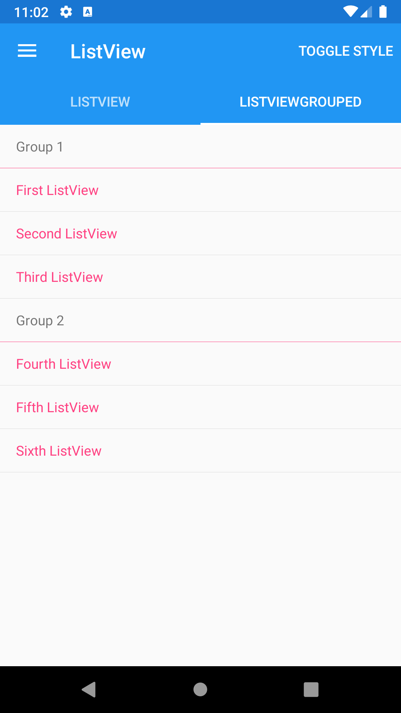





ListView and ListViewGrouped
--------
##### `topic last updated: v1.0 - 24.04.2021 - 11:47pm`

### [back to interface objects](view-interface-objects.html#interface-objects)

<br />

displays a scrollable list of selectable data

<br /> 

### Basic example ListView


```fsharp 
View.ListView(items = [
    View.TextCell "First ListView"; 
    View.TextCell "Second ListView"; 
    View.TextCell "Third ListView"
], itemSelected = (fun idx -> dispatch (ListViewSelectedItemChanged idx)) )    
```


The `itemSelected` callback uses integers indexes for keys to identify the elements.

There is also a `ListViewGrouped` for grouped items of data.  This uses the same Xamarin control under the hood but in a different mode of use.

<br /> <br /> 

### Basic example ListViewGrouped

```fsharp 
View.ListViewGrouped(items = [
    "Group 1", 
    View.TextCell "Group 1", 
    [
        View.TextCell "First ListView"; 
        View.TextCell "Second ListView"; 
        View.TextCell "Third ListView"
    ]
    "Group 2", 
    View.TextCell "Group 2", 
    [
        View.TextCell "Fourth ListView"; 
        View.TextCell "Fifth ListView"; 
        View.TextCell "Sixth ListView"
    ]                                     

], itemSelected = (fun idx -> dispatch (ListViewSelectedItemChanged idx)) )
```




<br /> <br /> 

See also:

* [ListView in Xamarin Forms](https://docs.microsoft.com/en-us/xamarin/xamarin-forms/user-interface/ListView)
* [`Xamarin.Forms.ListView`](https://docs.microsoft.com/en-us/dotnet/api/Xamarin.Forms.ListView)

### More examples


#### "Infinite" or "unbounded" ListViews
##### `topic last updated: pending`

"Infinite" (really "unbounded") lists are created by using the `itemAppearing` event to prompt a message which nudges the
underlying model in a direction that will then supply new items to the view.

For example, consider this pattern:

```fsharp
type Model =
    { ...
      LatestItemAvailable: int
    }

type Message =
    ...
    | GetMoreItems of int

let update msg model =
    match msg with
    | ...
    | GetMoreItems n -> { model with LatestItemAvailable = n }

let view model dispatch =
    ...
    View.ListView(
        items = [
            for i in 1 .. model.LatestItemAvailable do
                yield View.TextCell("Item " + string i)
        ],
        itemAppearing = (fun idx -> if idx >= max - 2 then dispatch (GetMoreItems (idx + 10) ) )
    )
...
```

Note:

* The underlying data in the model is just an integer `LatestItemAvailable` (normally it would really be a list of actual entities drawn from a data source)
* On each update to the view we produce all the visual items from `Item 1` onwards
* The `itemAppearing` event is called for each item, e.g. when item `10` appears
* When the event triggers we grow the underlying data model by 10
* This will trigger an update of the view again, with more visual elements available (but not yet appearing)

Surprisingly even this naive technique  is fairly efficient. There are numerous ways to make this more efficient (we aim to document more of these over time too).  One simple one is to memoize each individual visual item using `dependsOn`:

```fsharp
items = [
    for i in 1 .. model.LatestItemAvailable do
        yield dependsOn i (fun model i -> View.Label("Item " + string i))
]
```

With that, this simple list views scale to > 10,000 items on a modern phone, though your mileage may vary.
There are many other techniques (e.g. save the latest collection of visual element descriptions in the model, or to use a `ConditionalWeakTable` to associate it with the latest model).  We will document further techniques in due course.

Thre is also an `itemDisappearing` event for `ListView` that can be used to discard data from the underlying model and restrict the
range of visual items that need to be generated.