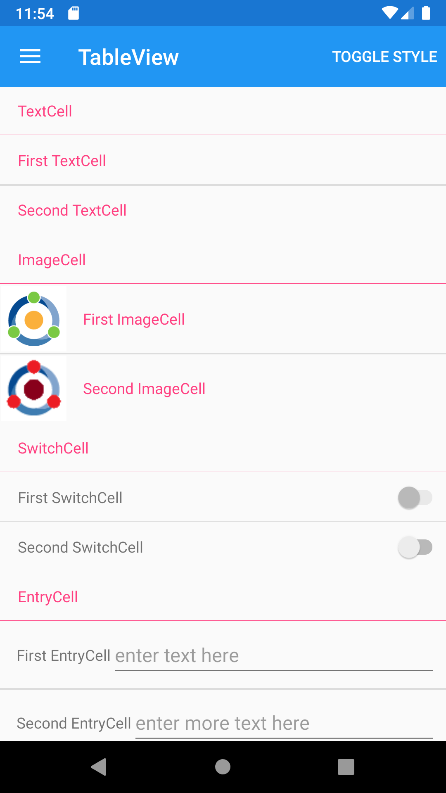





TableView
--------
##### `topic last updated: v1.0 - 24.04.2021 - 11:47pm`

### [back to interface objects](view-interface-objects.html#interface-objects)

<br />

displays a list of rows of type Cell with optional headers and subheaders

<br /> 

### Basic example


```fsharp 
View.TableView( root = 
    View.TableRoot( items = [
        View.TableSection
            (
                title = "TextCell",
                items = [
                    View.TextCell(text = "First TextCell") 
                    View.TextCell(text = "Second TextCell")
                ]
            )
        View.TableSection
            (
                title = "ImageCell",
                items = [
                    View.ImageCell(text = "First ImageCell", image = Image.ImagePath "icon.png") 
                    View.ImageCell(text = "Second ImageCell", image = Image.ImagePath "icon2.png") 
                ]
            )
        View.TableSection
            (
                title = "SwitchCell",
                items = [
                    View.SwitchCell(text = "First SwitchCell", isEnabled = false)
                    View.SwitchCell(text = "Second SwitchCell", isEnabled = true)
                ]
            )
        View.TableSection
            (
                title = "EntryCell",
                items = [
                    View.EntryCell(label = "First EntryCell", placeholder = "enter text here")
                    View.EntryCell(label = "Second EntryCell", placeholder = "enter more text here")
                ]
            )
    ] )
)
```



<br /> <br /> 

See also:

* [TableView in Xamarin Forms](https://docs.microsoft.com/en-us/xamarin/xamarin-forms/user-interface/TableView)
* [`Xamarin.Forms.TableView`](https://docs.microsoft.com/en-us/dotnet/api/Xamarin.Forms.TableView)


### More examples

