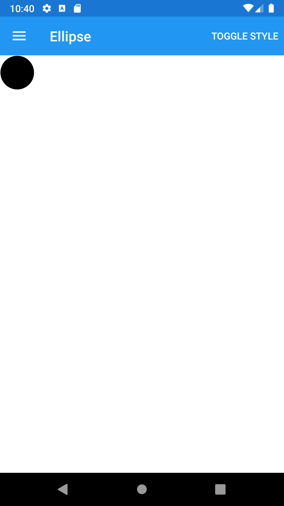





Ellipse
--------

<br /> 

### Basic example


```fsharp 
View.Ellipse(fill = View.SolidColorBrush(Color.Black), width = 50., height = 50.)
```



<br /> <br /> 

### Basic example with styling

```fsharp 
View.Ellipse
    (
        horizontalOptions = style.Position,
        verticalOptions = style.Position,
        backgroundColor = style.ViewColor,
        fill = View.SolidColorBrush(Color.Black),
        width = 50.,
        height = 50.
    )
```


<br /> <br /> 

See also:

* [Ellipse in Xamarin Forms](https://docs.microsoft.com/en-us/xamarin/xamarin-forms/user-interface/shapes/Ellipse)
* [`Xamarin.Forms.Ellipse`](https://docs.microsoft.com/en-us/dotnet/api/Xamarin.Forms.Ellipse)

<br /> 

### More examples

`Ellipse` can be used to draw ellipses and circles.

```fsharp 
View.Ellipse(
    width = 50.,
    height = 50.,
    fill = View.SolidColorBrush(Color.Orange),
    horizontalOptions = LayoutOptions.Center 
    )
```