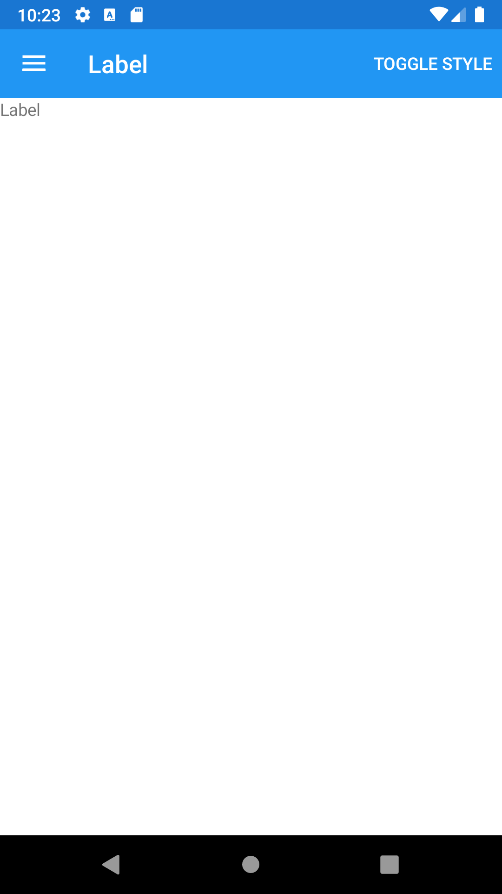





Label
--------
##### `topic last updated: v1.0 - 24.04.2021 - 11:47pm`

### [back to interface objects](view-interface-objects.html#interface-objects)

<br />

### Basic example


```fsharp 
View.Label("Label")
```



<br /> <br /> 

### Basic example with styling

```fsharp 
View.Label
    (
        horizontalOptions = style.Position,
        verticalOptions = style.Position,
        backgroundColor = style.ViewColor,
        padding = style.Padding,
        text = "Label"
    )
```


<br /> <br /> 

See also:

* [Label in Xamarin Forms](https://docs.microsoft.com/en-us/xamarin/xamarin-forms/user-interface/text/Label)
* [`Xamarin.Forms.Label`](https://docs.microsoft.com/en-us/dotnet/api/Xamarin.Forms.Label)

<br /> 

### More examples

The Label view is used for displaying text, both single and multi-line. Labels can have text decorations, colored text, and use custom fonts (families, sizes, and options).

```fsharp 
View.Label(text = "this is a label")