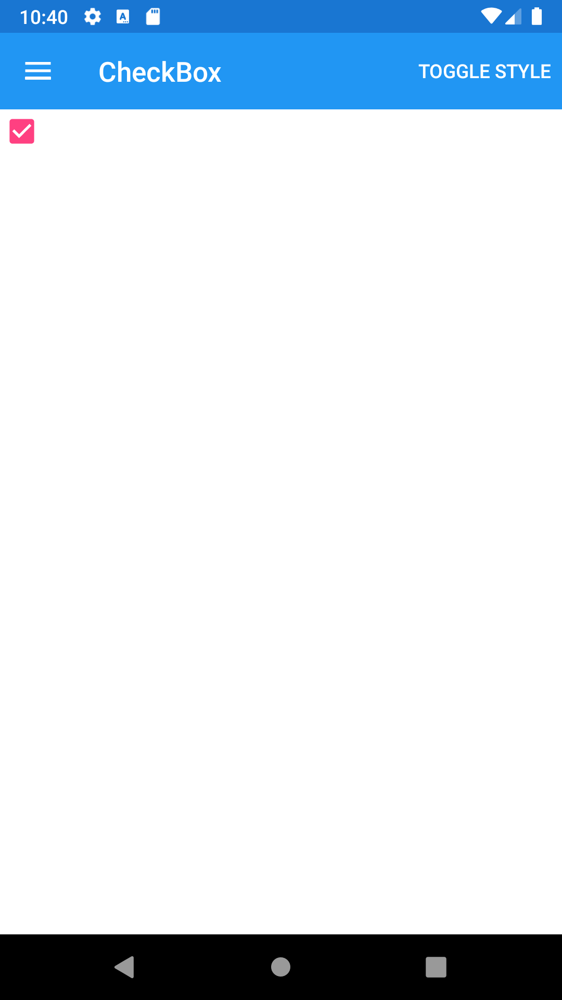
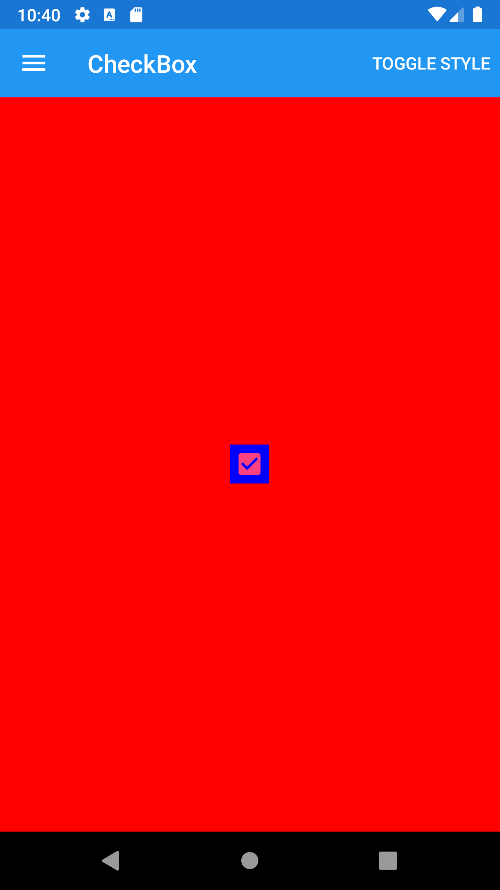





CheckBox
--------
##### `topic last updated: v1.0 - 24.04.2021 - 11:47pm`

### [back to interface objects](view-interface-objects.html#interface-objects)

<br />

### Basic example


```fsharp 
View.CheckBox(true)
```



<br /> <br /> 

### Basic example with styling

```fsharp 
View.CheckBox
    (
        horizontalOptions = style.Position,
        verticalOptions = style.Position,
        backgroundColor = style.LayoutColor,
        isChecked = true
    )
```




<br /> <br /> 

See also:

* [`Xamarin.Forms.CheckBox`](https://docs.microsoft.com/en-us/dotnet/api/Xamarin.Forms.CheckBox)

<br /> 

### More examples

```fsharp 

View.CheckBox(
    isChecked = true,
    checkedChanged = (fun on -> dispatch (...))
)
```