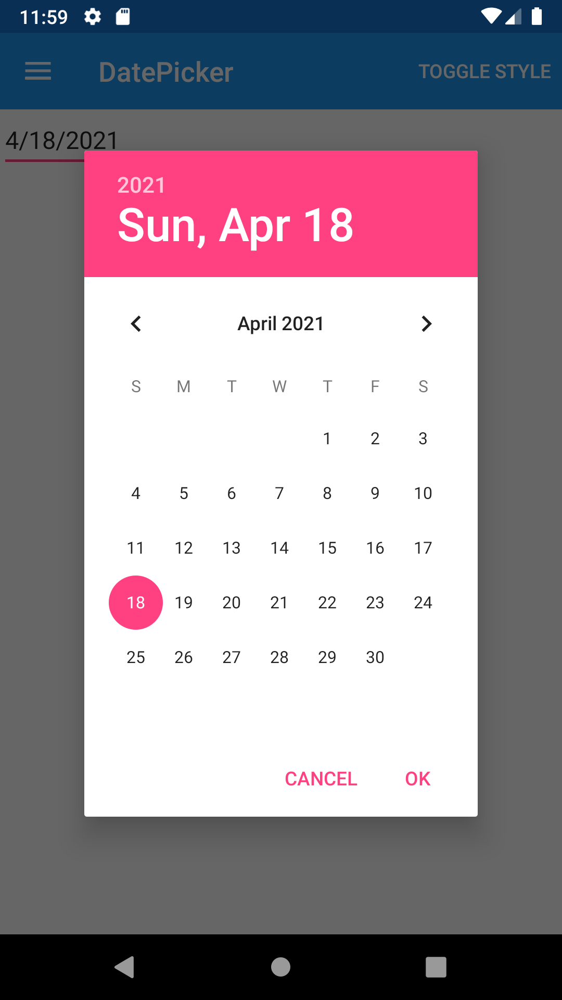
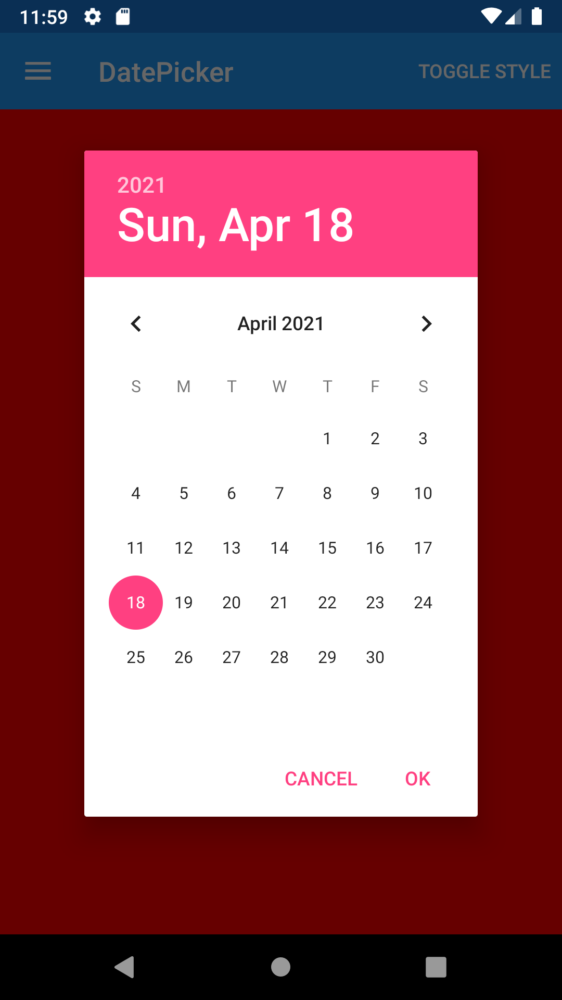





DatePicker
--------
##### `topic last updated: v1.0 - 24.04.2021 - 11:47pm`

### [back to interface objects](view-interface-objects.html#interface-objects)

<br />

### Basic example


```fsharp 
View.DatePicker()
```



<br /> <br /> 

### Basic example with styling

```fsharp 
View.DatePicker
    (
        horizontalOptions = style.Position,
        verticalOptions = style.Position,
        backgroundColor = style.ViewColor
    )
```




<br /> <br /> 

See also:

* [`Xamarin.Forms.DatePicker`](https://docs.microsoft.com/en-us/dotnet/api/Xamarin.Forms.DatePicker)

<br /> 

### More examples

```fsharp
View.DatePicker(minimumDate = DateTime.Today,
    maximumDate = DateTime.Today + TimeSpan.FromDays(365.0),
    date = startDate,
    dateSelected=(fun args -> dispatch (StartDateSelected args.NewDate)))
```

