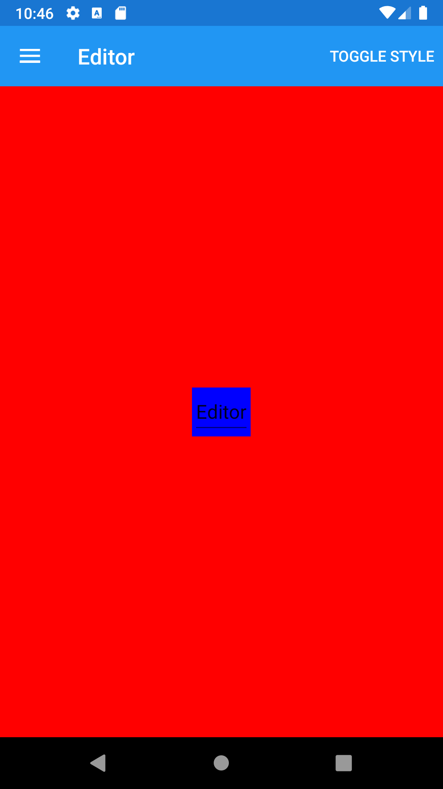





Interface objects (Views) for editing text
------
##### `topic last updated: v1.0 - 04.04.2021 - 02:51pm`
  

| Name                               | Description                                                  | Appearance                                                 |
|------------------------------------|--------------------------------------------------------------|------------------------------------------------------------|
| [Entry](view-if-ed-entry.html#entry)   | can be used to set and read the text presented by the Entry  |   |
| [Editor](view-if-ed-editor.html#editor) | can be used to set and read the text presented by the Editor |  |