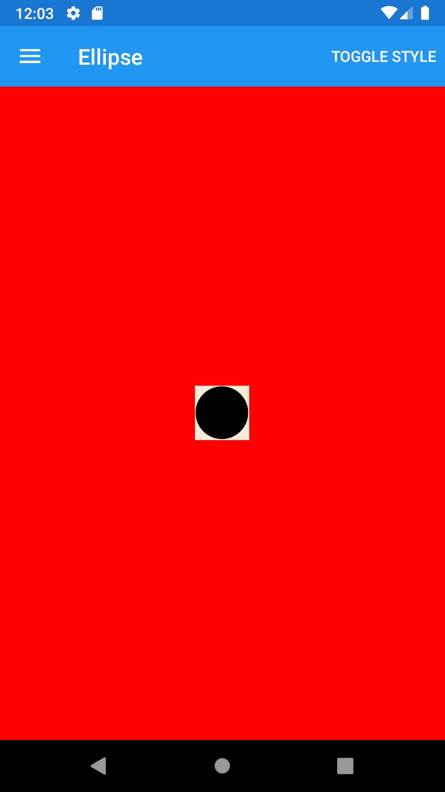
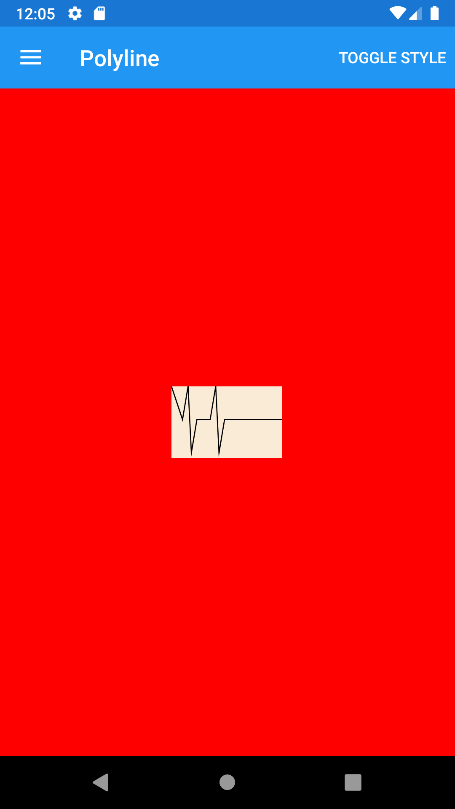
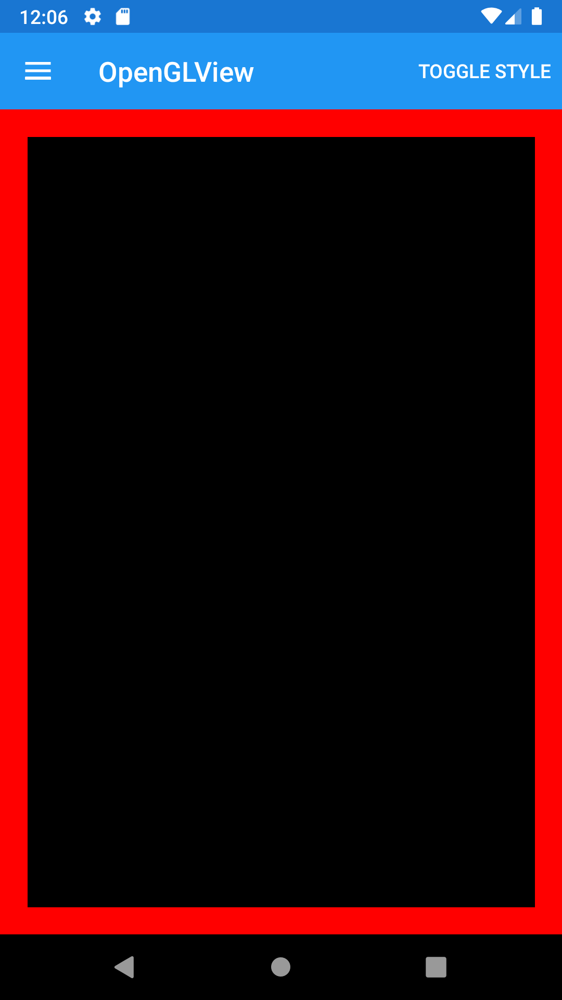





Interface objects (Views) for presentation
------
##### `topic last updated: v1.0 - 04.04.2021 - 02:51pm`
  

| Name                                          | Description                                                                                | Appearance                                                     |
|-----------------------------------------------|--------------------------------------------------------------------------------------------|----------------------------------------------------------------|
| [BoxView](view-if-p-boxview.html#boxview)       | renders a simple rectangle of a specified width, height, and color                         |     |
| [Image](view-if-p-image.html#image)           | can be loaded specifically for each platform, or they can be downloaded for display        |       |
| [Label](view-if-p-label.html#label)           | used for displaying text, both single and multi-line                                       |       |
| [Map](view-if-p-map.html#map)                 | a cross-platform view for displaying and annotating maps                                   | <!--  -->        |
| [Ellipse](view-if-p-ellipse.html#ellipse)       | derives from the Shape class, and can be used to draw ellipses and circles                 |     |
| [Line](view-if-p-line.html#line)             | derives from the Shape class, and can be used to draw lines                                |        |
| [Path](view-if-p-path.html#path)             | derives from the Shape class, and can be used to draw curves and complex shapes            |        |
| [Polygon](view-if-p-polygon.html#polygon)       | derives from the Shape class, and can be used to draw polygons                             |     |
| [Polyline](view-if-p-polyline.html#polyline)     | derives from the Shape class, and can be used to draw a series of connected straight lines |    |
| [Rectangle](view-if-p-rectangle.html#rectangle)   | derives from the Shape class, and can be used to draw rectangles and squares.              |   |
| [WebView](view-if-p-webview.html#webview)       | supports: HTML&CSS websites, Documents, HTML strings, Local Files                          |     |
| [OpenGlView](view-if-p-openglview.html#openglview) | displays OpenGL content                                                                    |  |