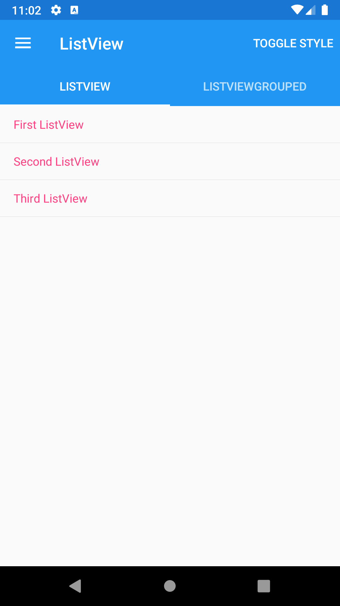
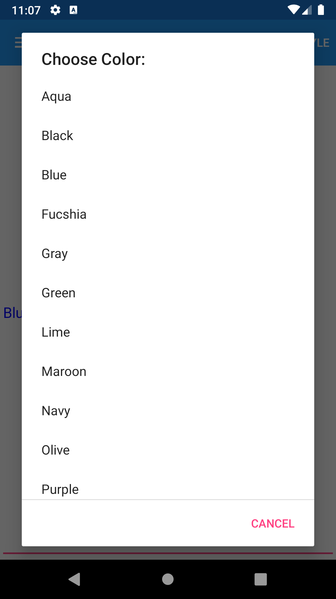
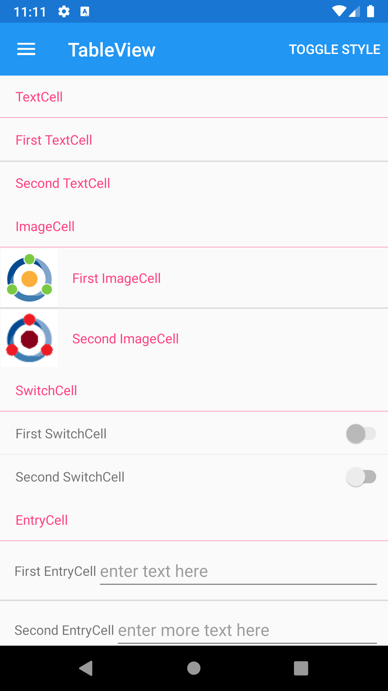





Interface objects (Views) for displaying collections
------
##### `topic last updated: v1.0 - 04.04.2021 - 11:30pm`
  

| Name                                                  | Description                                                                                                  | Appearance                                                         |
|-------------------------------------------------------|--------------------------------------------------------------------------------------------------------------|--------------------------------------------------------------------|
| [CarouselView](interface/display/carouselview.md)     | displays a scrollable list of data items                                                                     |    |
| [CollectionView](interface/display/collectionview.md) | displays a scrollable list of selectable data items, using different layout specifications                   |  |
| [IndicatorView](interface/display/indicatorview.md)   | displays indicators that represent the number of items in a CarouselView                                     |   |
| [ListView](interface/display/listview.md)             | displays a scrollable list of selectable data items                                                          |         |
| [Picker](interface/display/picker.md)                 | displays a selected item from a list of text strings, and allows selecting that item when the view is tapped |           |
| [TableView](interface/display/tableview.md)           | displays a list of rows of type Cell with optional headers and subheaders                                    |        |