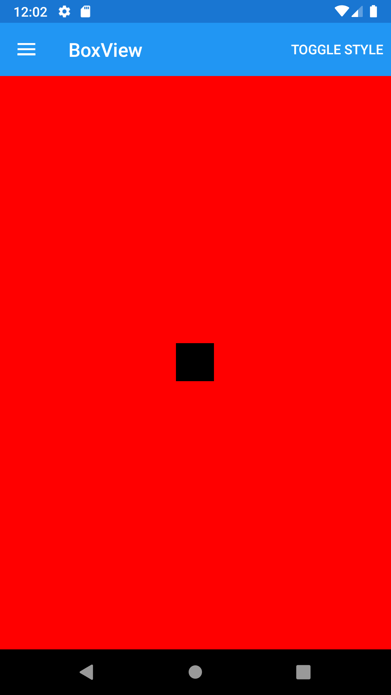
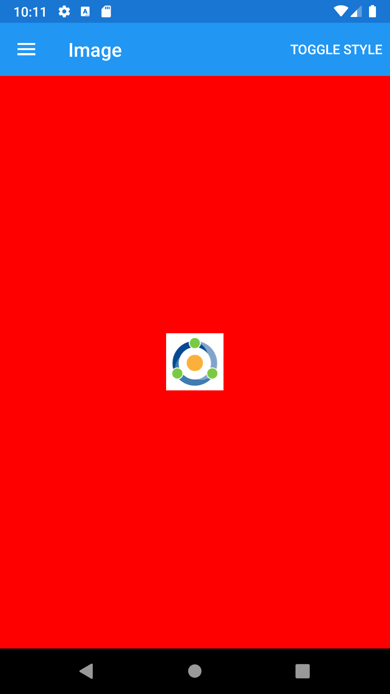
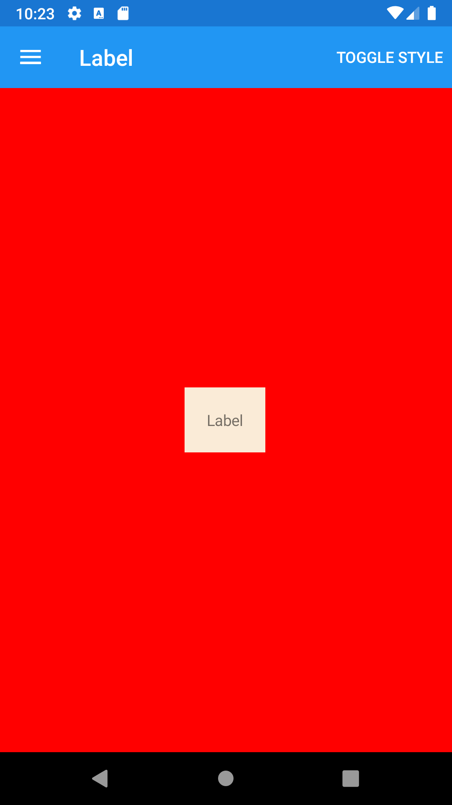
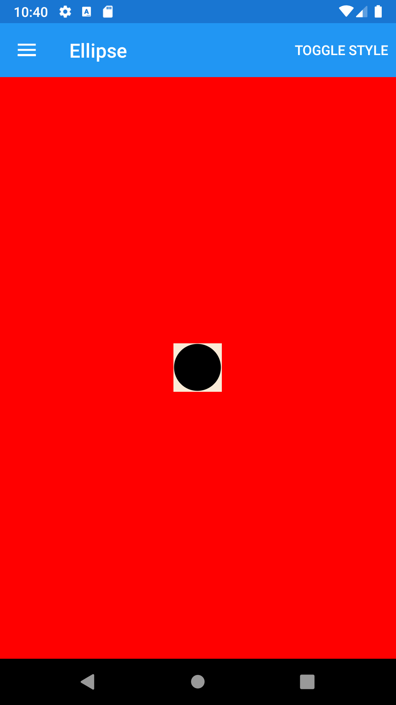
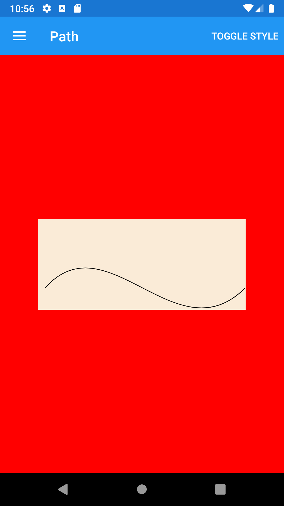
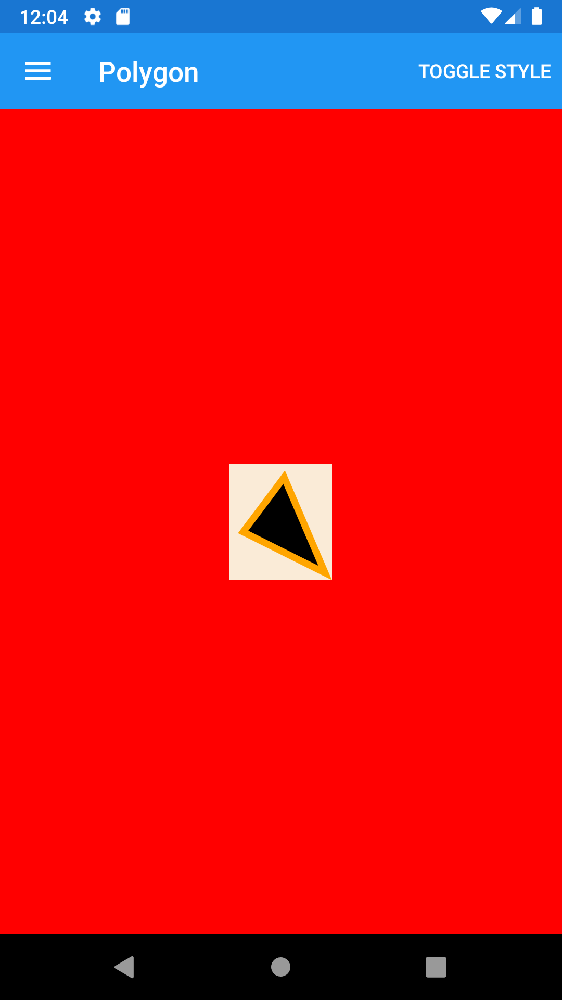
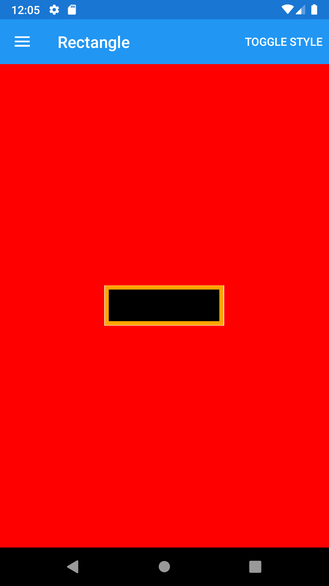





Interface objects (Views) for presentation
------
##### `topic last updated: v1.0 - 04.04.2021 - 02:51pm`
<br /> 

| Name                                      | Description                                                                                | Appearance                                                  |
|-------------------------------------------|--------------------------------------------------------------------------------------------|-------------------------------------------------------------|
| [BoxView](interface/present/BoxView.md)   | renders a simple rectangle of a specified width, height, and color                         |  |
| [Image](interface/present/Image.md)       | can be loaded specifically for each platform, or they can be downloaded for display        |    |
| [Label](interface/present/Label.md)       | used for displaying text, both single and multi-line                                       |    |
| [Map](interface/present/Map.md)           | a cross-platform view for displaying and annotating maps                                   |   |
| [Ellipse](interface/present/Ellipse.md)   | derives from the Shape class, and can be used to draw ellipses and circles                 |   |
| [Line](interface/present/Line.md)         | derives from the Shape class, and can be used to draw lines                                |   |
| [Path](interface/present/Path.md)         | derives from the Shape class, and can be used to draw curves and complex shapes            |   |
| [Polygon](interface/present/Polygon.md)   | derives from the Shape class, and can be used to draw polygons                             |   |
| [Polyline](interface/present/Polyline.md) | derives from the Shape class, and can be used to draw a series of connected straight lines |   |
| [Rectangle](interface/present/Rectangle.md)| derives from the Shape class, and can be used to draw rectangles and squares.              |   |
| [WebView](interface/present/WebView.md)   | supports: HTML&CSS websites, Documents, HTML strings, Local Files                          |   |
| [OpenGlView](interface/present/OpenGlView.md) | displays OpenGL content                                                                    |   |

### Label

The Label view is used for displaying text, both single and multi-line. Labels can have text decorations, colored text, and use custom fonts (families, sizes, and options).

```fsharp 
View.Label(text = "this is a label")
```

See also:

* [Label in Xamarin Forms](https://docs.microsoft.com/en-us/xamarin/xamarin-forms/user-interface/text/label)
* [`Xamarin.Forms.Label`](https://docs.microsoft.com/en-us/dotnet/api/xamarin.forms.label?view=xamarin-forms)

<br /> 

### Image
A simple image drawn from a resource or URL is as follows:

```fsharp
let monkey =  "http://upload.wikimedia.org/wikipedia/commons/thumb/f/fc/Papio_anubis_%28Serengeti%2C_2009%29.jpg/200px-Papio_anubis_%28Serengeti%2C_2009%29.jpg"
                    
View.Image( source =  Image.ImagePath monkey)
```


See also:

* [Images in Xamarin Forms](https://docs.microsoft.com/en-us/xamarin/xamarin-forms/user-interface/images?tabs=vswin)
* [`Xamarin.Forms.Image`](https://docs.microsoft.com/en-us/dotnet/api/Xamarin.Forms.Image)

<br /> 

### BoxView
An example `BoxView` is as follows:
```fsharp 
View.BoxView(
    color = Color.CornflowerBlue, 
    cornerRadius = CornerRadius 10., 
    horizontalOptions = LayoutOptions.Center
    )
```


See also:

* [`Xamarin.Forms.Core.BoxView`](https://docs.microsoft.com/en-us/dotnet/api/Xamarin.Forms.BoxView)

<br /> 

### Line

`Line` can be used to draw lines.

```fsharp 
View.Label(text = "Line")
View.Line(x1 = 40., y1 = 0., x2 = 0., y2 = 120., stroke = View.SolidColorBrush(Color.Red))

View.Label(text = "Line with stroke")
View.Line(x1 = 40., y1 = 0., x2 = 0., y2 = 120., stroke = View.SolidColorBrush(Color.DarkBlue), strokeThickness = 4.)

View.Label(text = "Dashed line")
View.Line(x1 = 40., y1 = 0., x2 = 0., y2 = 120., stroke = View.SolidColorBrush(Color.DarkBlue), strokeDashArray = [ 1.; 1. ], strokeDashOffset = 6.)

View.Label(text = "LineCap: Flat")
View.Line(x1 = 0., y1 = 20., x2 = 300., y2 = 20., stroke = View.SolidColorBrush(Color.Red), strokeThickness = 12., strokeLineCap = Shapes.PenLineCap.Flat)

View.Label(text = "LineCap: Square")
View.Line(x1 = 0., y1 = 20., x2 = 300., y2 = 20., stroke = View.SolidColorBrush(Color.Red), strokeThickness = 12., strokeLineCap = Shapes.PenLineCap.Square)

View.Label(text = "LineCap: Round")
View.Line(x1 = 0., y1 = 20., x2 = 300., y2 = 20., stroke = View.SolidColorBrush(Color.Red), strokeThickness = 12., strokeLineCap = Shapes.PenLineCap.Round)
```

See also:

* [Line in Xamarin Forms](https://docs.microsoft.com/en-us/xamarin/xamarin-forms/user-interface/shapes/Line)
* [`Xamarin.Forms.Shapes.Line`](https://docs.microsoft.com/en-us/dotnet/api/xamarin.forms.shapes.Line?view=xamarin-forms)

<br /> 

### Ellipse

`Ellipse` can be used to draw ellipses and circles.

```fsharp 
View.Ellipse(
    width = 50.,
    height = 50.,
    fill = View.SolidColorBrush(Color.Orange),
    horizontalOptions = LayoutOptions.Center 
    )
```

See also:

* [Ellipse in Xamarin Forms](https://docs.microsoft.com/en-us/xamarin/xamarin-forms/user-interface/shapes/Ellipse)
* [`Xamarin.Forms.Shapes.Ellipse`](https://docs.microsoft.com/en-us/dotnet/api/xamarin.forms.shapes.Ellipse?view=xamarin-forms)

<br /> 

### Path

 `Path` can be used to draw curves and complex shapes. These curves and shapes are often described using Geometry objects. 

```fsharp 
View.Label(text = "Path")
View.Path(
    stroke = View.SolidColorBrush(Color.Black),
    aspect = Stretch.Uniform,
    horizontalOptions = LayoutOptions.Center,
    data = Content.fromString "M 10,50 L 200,70"
)

View.Label(text = "Cubic Bezier Path")
View.Path(
    stroke = View.SolidColorBrush(Color.Black),
    aspect = Stretch.Uniform,
    horizontalOptions = LayoutOptions.Center,
    data = Content.fromString "M 10,100 C 100,0 200,200 300,100"
)
```

See also:

* [Path in Xamarin Forms](https://docs.microsoft.com/en-us/xamarin/xamarin-forms/user-interface/shapes/path)
* [`Xamarin.Forms.Shapes.Path`](https://docs.microsoft.com/en-us/dotnet/api/xamarin.forms.shapes.path?view=xamarin-forms)

<br /> 

### Polygon

`Polygon` can be used to draw polygons, which are connected series of lines that form closed shapes. 

```fsharp 
let polygonPoints1 = "40,10 70,80 10,50"
let polygonPoints2 = "0 48, 0 144, 96 150, 100 0, 192 0, 192 96, 50 96, 48 192, 150 200 144 48"

View.Label("Polygon")
View.Polygon(
    points = Points.fromString polygonPoints1,
    fill = View.SolidColorBrush(Color.AliceBlue),
    stroke = View.SolidColorBrush(Color.Green),
    strokeThickness = 5.
)

View.Label("Polygon with dashed stroke")
View.Polygon(
    points = Points.fromString polygonPoints1,
    fill = View.SolidColorBrush(Color.AliceBlue),
    stroke = View.SolidColorBrush(Color.Green),
    strokeThickness = 5.,
    strokeDashArray = [ 1.; 1. ],
    strokeDashOffset = 6.
)

View.Label("EvenOdd polygon")
View.Polygon(
    points = Points.fromString polygonPoints2,
    fill = View.SolidColorBrush(Color.Blue),
    fillRule = Shapes.FillRule.EvenOdd,
    stroke = View.SolidColorBrush(Color.Red),
    strokeThickness = 3.
)

View.Label("NonZero polygon")
View.Polygon(
    points = Points.fromString polygonPoints2,
    fill = View.SolidColorBrush(Color.Black),
    fillRule = Shapes.FillRule.Nonzero,
    stroke = View.SolidColorBrush(Color.Yellow),
    strokeThickness = 3.
)
```

See also:

* [Polygon in Xamarin Forms](https://docs.microsoft.com/en-us/xamarin/xamarin-forms/user-interface/shapes/polygon)
* [`Xamarin.Forms.Shapes.Polygon`](https://docs.microsoft.com/en-us/dotnet/api/xamarin.forms.shapes.polygon?view=xamarin-forms)

<br /> 

### Polyline

`Polyline` can be used to draw a series of connected straight lines. A polyline is similar to a polygon, except the last point in a polyline is not connected to the first point. 

```fsharp 
let polylinePoints1 = "0,0 10,30, 15,0 18,60 23,30 35,30 40,0 43,60 48,30 100,30"
let polylinePoints2 = "0 48, 0 144, 96 150, 100 0, 192 0, 192 96, 50 96, 48 192, 150 200 144 48"
let polylinePoints3 = "20 20,250 50,20 120"

View.Label("Polygon")
View.Polyline(
    points = Points.fromString polylinePoints1,
    stroke = View.SolidColorBrush(Color.Red),
    strokeThickness = 1.
)

View.Label("Polyline with dashed stroke")
View.Polyline(
    points = Points.fromString polylinePoints1,
    stroke = View.SolidColorBrush(Color.Red),
    strokeThickness = 2.,
    strokeDashArray = [ 1.; 1. ],
    strokeDashOffset = 6.
)

View.Label("EvenOdd polyline")
View.Polyline(
    points = Points.fromString polylinePoints2,
    fill = View.SolidColorBrush(Color.Blue),
    fillRule = Shapes.FillRule.EvenOdd,
    stroke = View.SolidColorBrush(Color.Red),
    strokeThickness = 3.
)

View.Label("NonZero polyline")
View.Polyline(
    points = Points.fromString polylinePoints2,
    fill = View.SolidColorBrush(Color.Black),
    fillRule = Shapes.FillRule.Nonzero,
    stroke = View.SolidColorBrush(Color.Yellow),
    strokeThickness = 3.
)

View.Label("LineJoin: Miter")
View.Polyline(
    points = Points.fromString polylinePoints3,
    stroke = View.SolidColorBrush(Color.DarkBlue),
    strokeThickness = 20.,
    strokeLineJoin = Shapes.PenLineJoin.Miter
)

View.Label("LineJoin: Bevel")
View.Polyline(
    points = Points.fromString polylinePoints3,
    stroke = View.SolidColorBrush(Color.DarkBlue),
    strokeThickness = 20.,
    strokeLineJoin = Shapes.PenLineJoin.Bevel
)

View.Label("LineJoin: Round")
View.Polyline(
    points = Points.fromString polylinePoints3,
    stroke = View.SolidColorBrush(Color.DarkBlue),
    strokeThickness = 20.,
    strokeLineJoin = Shapes.PenLineJoin.Round
)
```

See also:

* [Polyline in Xamarin Forms](https://docs.microsoft.com/en-us/xamarin/xamarin-forms/user-interface/shapes/polyline)
* [`Xamarin.Forms.Shapes.Polyline`](https://docs.microsoft.com/en-us/dotnet/api/xamarin.forms.shapes.polyline?view=xamarin-forms)

<br /> 

### Rectangle

`Rectangle` can be used to draw rectangles and squares. 

```fsharp 
View.Label("Filled rectangle")
View.Rectangle(
    fill = View.SolidColorBrush(Color.Red),
    width = 150.,
    height = 50.,
    horizontalOptions = LayoutOptions.Start
)

View.Label("Square")
View.Rectangle(
    stroke = View.SolidColorBrush(Color.Red),
    strokeThickness = 4.,
    width = 150.,
    height = 150.,
    horizontalOptions = LayoutOptions.Start
)

View.Label("Rectangle with stroke")
View.Rectangle(
    stroke = View.SolidColorBrush(Color.Red),
    strokeThickness = 4.,
    width = 150.,
    height = 50.,
    horizontalOptions = LayoutOptions.Start
)

View.Label("Filled rectangle with stroke")
View.Rectangle(
    fill = View.SolidColorBrush(Color.DarkBlue),
    stroke = View.SolidColorBrush(Color.Red),
    strokeThickness = 4.,
    width = 150.,
    height = 50.,
    horizontalOptions = LayoutOptions.Start
)

View.Label("Filled rectangle with dashed stroke")
View.Rectangle(
    fill = View.SolidColorBrush(Color.DarkBlue),
    stroke = View.SolidColorBrush(Color.Red),
    strokeThickness = 4.,
    strokeDashArray = [ 1.; 1. ],
    strokeDashOffset = 6.,
    width = 150.,
    height = 50.,
    horizontalOptions = LayoutOptions.Start
)

View.Label("Rectangle with rounded corners")
View.Rectangle(
    fill = View.SolidColorBrush(Color.Blue),
    stroke = View.SolidColorBrush(Color.Black),
    strokeThickness = 3.,
    radiusX = 50.,
    radiusY = 10.,
    width = 200.,
    height = 100.,
    horizontalOptions = LayoutOptions.Start
)
```

See also:

* [Rectangle in Xamarin Forms](https://docs.microsoft.com/en-us/xamarin/xamarin-forms/user-interface/shapes/rectangle)
* [`Xamarin.Forms.Shapes.Rectangle`](https://docs.microsoft.com/en-us/dotnet/api/xamarin.forms.shapes.rectangle?view=xamarin-forms)

<br /> 

### WebView

`WebView` is a view for displaying web and HTML content in your app:

```fsharp 
let fabulousSite = "https://fsprojects.github.io/Fabulous/Fabulous.XamarinForms/"
View.WebView( 
    source = UrlWebViewSource.op_Implicit fabulousSite, 
    backgroundColor = Color.Red,
    margin = Thickness(20.)
)
```

See also:

* [WebView in Xamarin Forms](https://docs.microsoft.com/en-us/xamarin/xamarin-forms/user-interface/webview?tabs=windows)
* [`Xamarin.Forms.Shapes.WebView`](https://docs.microsoft.com/en-us/dotnet/api/xamarin.forms.webview?view=xamarin-forms)

<br /> 

### Map

This topic is covered [here](extensions-maps.md)

<br /> 

### OpenGLView

A View that displays OpenGL content.

```fsharp
View.OpenGLView(
    hasRenderLoop = true,
    margin = Thickness 20.
)
```
See also:

* [`Xamarin.Forms.Shapes.OpenGLView`](https://docs.microsoft.com/en-us/dotnet/api/xamarin.forms.openglview?view=xamarin-forms)