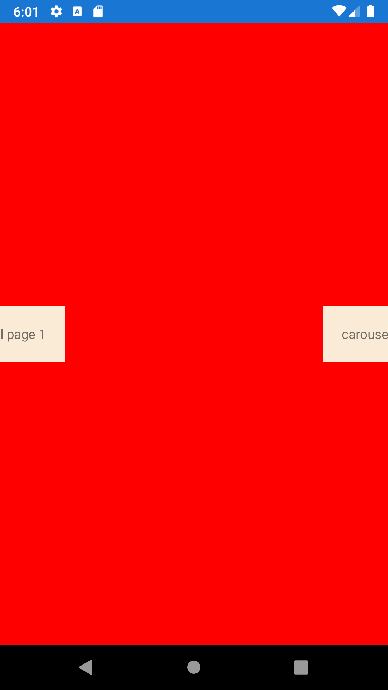
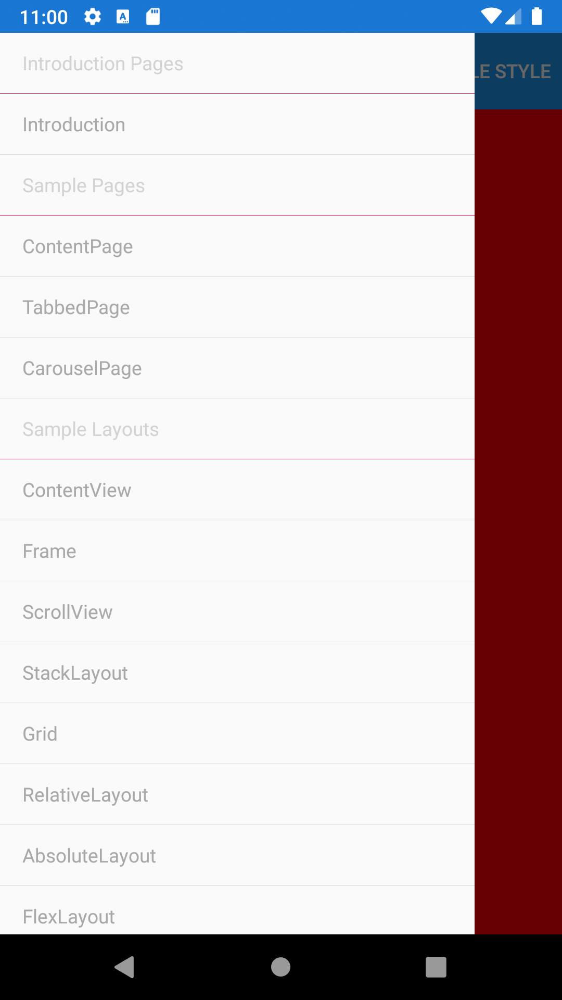
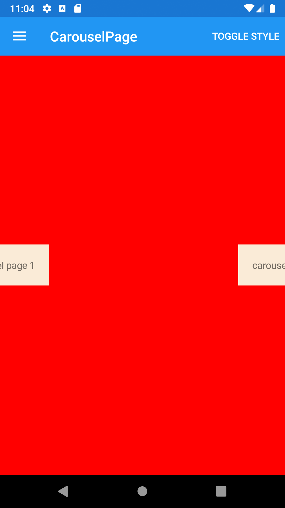





Pages 
------

##### `topic last updated: v1.0 - 02.04.2021 - 11:47pm`
<br /> 

 These visual elements occupy all or most of the screen and usually contain several layers of lower tier visual elements. 
 For example, a ContentPage may contain a StackLayout which in turn contains several buttons, labeles or other view elements. 

| Page type          | Description                                                                                          | Appearance |
|----------------|------------------------------------------------------------------------------------------------------|---------------------------|
| [ContentPage](pages/contentpage.md)    | a simple page, containing a single View object (usually a layout)                                    ||
| [FlyoutPage](pages/flyoutpage.md)     | contains a flyout pane (usually a list or menu) plus a detail pane (usually showing a selected item) ||
| [NavigationPage](pages/navigationpage.md) | manages navigation among other pages using a stack-based architecture                                ||
| [TabbedPage](pages/tabbedpage.md)     | allows navigation among child pages using tabs                                                       ||
| [CarouselPage](pages/carouselpage.md)   | allows navigation among child pages through finger swiping                                           ||


<br /> 

See also 
[Multi-page Applications and Navigation](pages-navigation.md)
[Shells](views-shells.md)

<br /> 

Examples
------
<br />

### ContentPage

A single page app typically returns a `ContentPage`. For example:

```fsharp 
View.ContentPage(
    backgroundColor = style.PageColor,
    title = "ContentPage",
    content = 
        View.Label
            (   
                horizontalOptions = LayoutOptions.Start,
                verticalOptions = LayoutOptions.Start,
                backgroundColor = Color.White,
                padding = Thickness 0.,
                text = sprintf "ContentPage with a single Label" 
            )
)
```


See also:

* [`Xamarin.Forms.ContentPage`](https://docs.microsoft.com/en-us/dotnet/api/Xamarin.Forms.ContentPage)

### FlyoutPage
```fsharp 
View.FlyoutPage(
    flyout = 
        View.ContentPage(
            backgroundColor = style.PageColor,
            title = "FlyoutPage",
            content = 
                View.StackLayout( children = [
                    View.ListViewGrouped(
                        items = [ 
                            "Introduction Pages", View.TextCell("Introduction Pages", textColor = Color.LightGray), (pagesToNavigateName introductionPages)
                            "Sample Pages", View.TextCell("Sample Pages", textColor = Color.LightGray), pagesToNavigateName (SamplePages.samplePages model.MyStyle)
                            "Sample Layouts", View.TextCell("Sample Layouts", textColor = Color.LightGray), pagesToNavigateName (SampleLayouts.sampleLayouts model.MyStyle)
                            "Sample Displays", View.TextCell("Sample Displays", textColor = Color.LightGray), pagesToNavigateName (SampleDisplays.sampleDisplays model.MyStyle)
                        ], 
                        itemSelected = (fun idx -> dispatch (ListViewSelectedItemChanged idx.Value); dispatch (ResetStyle))
                    )
                ])
    detail = 
        View.NavigationPage
            (   
                title = "details", 
                pages = [
                    activePage model.SelectedPage
                ] 
            )
)
```


See also:

* [`Xamarin.Forms.FlyoutPage`](https://docs.microsoft.com/en-us/dotnet/api/Xamarin.Forms.FlyoutPage)

### NavigationPage
```fsharp 
View.NavigationPage(
    pages = [
        View.ContentPage(
                title ="Navigation Page", 
                content = 
                    View.Label
                        (
                            horizontalOptions = LayoutOptions.Start,
                            verticalOptions = LayoutOptions.Start,
                            backgroundColor = Color.White,
                            padding = Thickness 0.,
                            text = "navigation page 1"
                        )
        )
])
```


See also:

* [`Xamarin.Forms.NavigationPage`](https://docs.microsoft.com/en-us/dotnet/api/Xamarin.Forms.NavigationPage)

### TabbedPage
```fsharp       
View.TabbedPage(
    backgroundColor = style.PageColor,
    title ="TabbedPage",
    children = [
        View.ContentPage( title ="First Tab", content = View.Label
            (                                 
                horizontalOptions = LayoutOptions.Start,
                verticalOptions = LayoutOptions.Start,
                backgroundColor = Color.White,
                padding = Thickness 0.,
                text = "TabbedPage 1" 
            ) 
        )
        View.ContentPage( title ="Second Tab", content = View.Label
            (                                
                horizontalOptions = LayoutOptions.Start,
                verticalOptions = LayoutOptions.Start,
                backgroundColor = Color.White,
                padding = Thickness 0.,
                text = "TabbedPage 2"
            ) 
        )                
    ] )
```


See also:

* [`Xamarin.Forms.TabbedPage`](https://docs.microsoft.com/en-us/dotnet/api/Xamarin.Forms.TabbedPage)

### CarouselPage
```fsharp 
View.CarouselPage(
    backgroundColor = style.PageColor,
    title = "CarouselPage",
    children = [
        View.ContentPage(title ="carousel1", content = View.Label
            (
                horizontalOptions = LayoutOptions.Start,
                verticalOptions = LayoutOptions.Start,
                backgroundColor = Color.White,
                padding = Thickness 0.,
                text = "carousel page 1"
            )
        )                
        View.ContentPage(title ="carousel1", content = View.Label
            (
                horizontalOptions = LayoutOptions.Start,
                verticalOptions = LayoutOptions.Start,
                backgroundColor = Color.White,
                padding = Thickness 0.,
                text = "carousel page 2"
            )
        )
    ]
)
```



See also:

* [`Xamarin.Forms.CarouselPage`](https://docs.microsoft.com/en-us/dotnet/api/Xamarin.Forms.CarouselPage)