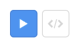

Widgets all come with a default style.  
You will most certainly want to override those default styles to make your app look good.

In Fabulous, this is done by adding modifiers to your widgets.  
We will see in this page how to add those modifiers and how to reuse a style across your app.

## Basic styling

Adding some basic style is easy.  
You simply need to apply modifiers on the widget you want to style by using the dot notation.

```fs
Label("Hello, World!")
    .font(size = 18.) // Set the font size to 18 points
    .textColor(Color.Red.ToFabColor()) // Change the text color to red
    .padding(10.) // Apply a padding of 10px
```

That's it!  
You can explore available modifiers on each widget by simply typing `.` (dot) after the widget itself.

```fs
ContentPage(
    "Dashboard",
    ScrollView(
        (VStack() {
            Label("Hello, World!")
                .textColor(Color.Red.ToFabColor())

            Button("Click me!")
                .backgroundColor(Color.Blue.ToFabColor())
        })
            .margin(Thickness(10., 0.))
    )
        .verticalScrollBarVisibility(ScrollBarVisibility.Never)
)
    .hasNavigationBar(false)
```

_Note: to be able to apply modifiers to widgets accepting multiple children (like `VStack`), you will need to wrap the parent and its children in parenthesis like this `(VStack() { child1 ... child2 }).modifier()`. Otherwise, F# won't allow you to apply modifiers.  
A suggestion to change the F# language is currently under review. Give it a thumb up if you'd like to see it in the future:  
[F# Suggestion: Allow dot notation after body of computation expression without need for parenthesis](https://github.com/fsharp/fslang-suggestions/issues/1163)_

In case you want to see which modifiers are available for a certain widget, you can refer to the API documentation of that widget: [API documentation](/v2/api/controls)

## Applying a same style across multiple widgets

When building your app, you will probably want to apply the same style to multiple places.  
The bruteforce way is to simply repeat the same modifiers on each widget.

```fs
Label("Hello")
    .horizontalTextAlignment(TextAlignment.Start)
    .font(namedSize = NamedSize.Large, fontFamily = "Helvetica")
    .textColor(Color.Blue.ToFabColor())
    .padding(10.)

Label("World")
    .horizontalTextAlignment(TextAlignment.End)
    .font(namedSize = NamedSize.Large, fontFamily = "Helvetica")
    .textColor(Color.Blue.ToFabColor())
    .padding(10.)
    .backgroundColor(Color.Red.ToFabColor())
```

While it works, it has several drawbacks:

- Lots of repeated code
- Less readable
- Less maintainable

You might want to refactor and extract that style to be able to reuse it across your app.  
Fortunately, Fabulous has you covered.

When you want to apply the same group of modifiers on each widgets of a same type, you can write your own shorthand modifier:

```fs
open System.Runtime.CompilerServices

[<Extension>]
type SharedStyle =
    [<Extension>]
    static member inline largeText(this: WidgetBuilder<'msg, #ILabel>) =
        this
            .font(namedSize = NamedSize.Large, fontFamily = "Helvetica")
            .textColor(Color.Blue.ToFabColor())
            .padding(10.)

// Usage
Label("Hello")
    .horizontalTextAlignment(TextAlignment.Start)
    .largeText()

Label("World")
    .horizontalTextAlignment(TextAlignment.End)
    .largeText()
    .backgroundColor(Color.Red.ToFabColor())
```

As you can see, the `largeText` modifier will automatically apply the font size, the font family, the text alignment, the text color and the padding to all `Label` widgets where it's applied.  
In addition to this shorthand modifier, you can still use all available modifiers on the same widget.

### How to write a shorthand modifier

Writing a shorthand modifier can be overwhelming the first time.  
It is making use of several advanced features of F#. Let's take a step back and decompose the code.

First thing to understand is that a shorthand modifier is actually implemented as an [extension method](https://docs.microsoft.com/en-us/dotnet/fsharp/language-reference/type-extensions).

To write an extension method, you need to have the following basic structure:

```fs
// Opening this namespace is required to use the Extension attribute below
open System.Runtime.CompilerServices

// No constructor is needed for this type. There will only be static methods declared inside.
[<Extension>]
type SomeTypeHoldingExtensionMethods =
    // The first parameter has to be the type we want to extend
    [<Extension>]
    static member SomeExtensionMethod(this: TypeForWhichWeWantToAddAnExtension) =
        // here we do something with the parameter this
        this
```

Let's start by adding the keyword `inline` before the name of the method. This will let Fabulous optimize the code for better performances at runtime.

```fs
[<Extension>]
static member inline SomeExtensionMethod(this: TypeForWhichWeWantToAddAnExtension) =
```

**Now, the most important part to understand:** when using a widget, Fabulous will actually give you an instance of `WidgetBuilder<'msg, 'marker>` where `'marker` will be a type representing the widget.  
For example, `Label()` will give you `WidgetBuilder<'msg, ILabel>`,

You might have noticed that in the code above, we are using `#ILabel` instead of `ILabel`. This `#` (pound) symbol is called a [flexible type annotation](https://docs.microsoft.com/en-us/dotnet/fsharp/language-reference/flexible-types).  
It lets F# know that we actually want the shorthand modifier to be available to all widgets deriving from `ILabel`, not just `Label`.

Another example that will make more sense is the `backgroundColor` modifier of `VisualElement`.  
`VisualElement` is a common ancestor to most widgets (`Label`, `Button`, `Image`, etc.). They all can have a background color.  
So, by using the flexible type annotation, Fabulous will make the `backgroundColor` modifier available to all widgets that derive from `IVisualElement` like `Label` and `Button`.

Adding this annotation depends on your needs.  
We recommend you add it by default. If you don't add it, the shorthand modifier will only be available to the specific widget type you are targeting.

Now, let's get back to our example. Based on all we just said, you should have the following code:

```fs
open System.Runtime.CompilerServices

[<Extension>]
type SharedStyle =
    [<Extension>]
    static member inline largeText(this: WidgetBuilder<'msg, #ILabel>) =
        this
```

Here on the last line, `this` is actually the widget you're trying to modify. So, you have access to all its modifiers and can write the style you want to share.

```fs
this
    .font(namedSize = NamedSize.Large, fontFamily = "Helvetica")
    // ...
```

Which gives us the example we saw at the beginning:

```fs
open System.Runtime.CompilerServices

[<Extension>]
type SharedStyle =
    [<Extension>]
    static member inline largeText(this: WidgetBuilder<'msg, #ILabel>) =
        this
            .font(namedSize = NamedSize.Large, fontFamily = "Helvetica")
            .horizontalTextAlignment(TextAlignment.End)
            .textColor(Color.Blue.ToFabColor())
            .padding(10.)
```

## Reusing a widget and its style

There are 2 ways of reusing a widget and its style:

- With a function
- With a custom widget

They both have pros and cons, use the one that fits your needs.

### With a function

Since in F# everything is function, you can reuse a widget by putting it in its own function.

```fs
module CustomViews =
    let largeLabel (text: string) =
        Label(text)
            .horizontalTextAlignment(TextAlignment.Start)
            .font(namedSize = NamedSize.Large, fontFamily = "Helvetica")
            .textColor(Color.Blue.ToFabColor())
            .padding(10.)

// Usage
open CustomViews

largeLabel("Hello")
    .horizontalTextAlignment(TextAlignment.Start)

largeLabel("World")
    .horizontalTextAlignment(TextAlignment.End)
    .backgroundColor(Color.Red.ToFabColor())
```

**Pros:** Easy to write  
**Cons:** Don't support optional parameters, not easily shared across multiple projects

### With a custom widget

In case you want to share a widget with other projects (like in a NuGet packages), or if you want to optionally override some modifiers, you can use a custom widget.

```fs
[<AutoOpen>]
module LargeLabelBuilders =
    type Fabulous.XamarinForms.View with
        static member inline LargeLabel(text: string, ?textColor: FabColor) =
            let textColor = match textColor with Some c -> c | None -> Color.Default.ToFabColor()
            Label(text)
                .horizontalTextAlignment(TextAlignment.Start)
                .font(namedSize = NamedSize.Large, fontFamily = "Helvetica")
                .textColor(textColor)
                .padding(10.)

// Usage
LargeLabel("Hello")
    .horizontalTextAlignment(TextAlignment.Start)

LargeLabel("World", textColor = Color.Blue.ToFabColor())
    .horizontalTextAlignment(TextAlignment.End)
    .backgroundColor(Color.Red.ToFabColor())
```

It's essentially the same than the function above, but you can have optional overrides by using the `?` (question mark) symbol before a parameter.  
Also, custom widgets are more easily discoverable since they will be available at the same place with all other widgets, hence better for sharing with others.

_Note:_ it is generally better to annotate the module with `[<AutoOpen>]` to automatically show the custom widget to everyone without first having to open the namespace.

_Perf note:_ it is strongly recommended to add the `inline` keyword to allow Fabulous to optimize the code for better performances at runtime.

**Pros:** support optional parameters, easy to share across multiple projects  
**Cons:** harder to write

## Reusing a complex hierarchy of widgets

Same as above, you can make use of the same 2 techniques to reuse a set of widgets.

```fs
// Via a function
module MyViews =
    let userView (user: User) =
        HStack(spacing = 10.) {
            Image(Aspect.AspectFit, user.AvatarUrl)
                .size(width = 50, height = 50)
                .cornerRadius(25.)
                .padding(10.)

            Label(user.Name)
                .font(namedSize = NamedSize.Large)
                .centerTextVertical()
        }

/// Via a custom widget
[<AutoOpen>]
module UserView =
    type Fabulous.XamarinForms.View with
        static member inline UserView(user: User) =
            HStack(spacing = 10.) {
                Image(Aspect.AspectFit, user.AvatarUrl)
                    .size(width = 50, height = 50)
                    .cornerRadius(25.)
                    .padding(10.)

                Label(user.Name)
                    .font(namedSize = NamedSize.Large)
                    .centerTextVertical()
            }


// Usage
open MyViews

/// Function
userView model.User

/// Custom widget
UserView(model.User)
```

### Real world example

Here is an example coming from the Gallery app sample.  
We need to let the user switch between 2 views: the running samples and the samples' code.



It is essentially 2 radio buttons that are linked together. They share a custom style.  
To do that, we created a `radioButton` function that let us reuse a frame with a label to act as a single radio button.  
Then, we created a custom widget `SampleViewSelector` to be able to have several radio buttons together and know which one is selected.

```fs
type SampleViewType =
     | Run
     | Code

 type SampleView =
     { Value: SampleViewType
       Text: string }

 module SampleViewSelector =
     let radioButton (text: string) (isSelected: bool) (onSelected: 'msg) =
         Frame(
             Label(text)
                 .centerTextHorizontal()
                 .centerTextVertical()
                 .font(namedSize = NamedSize.Body, fontFamily = "Icomoon")
                 .textColor(if isSelected then Color.White.ToFabColor() else Color.LightGray.ToFabColor())
         )
             .hasShadow(false)
             .size(width = 36., height = 36.)
             .padding(0.)
             .borderColor(if isSelected then FabColor.fromHex "#1a76d2" else Color.LightGray.ToFabColor())
             .backgroundColor(if isSelected then FabColor.fromHex "#2196f3" else Color.White.ToFabColor())
             .gestureRecognizers() {
                 TapGestureRecognizer(onSelected)
             }

 [<AutoOpen>]
 module SampleViewSelectorBuilders =
     type Fabulous.XamarinForms.View with
         static member inline SampleViewSelector(items: SampleView list, selectedItem: SampleViewType, onSelectionChanged: SampleViewType -> 'msg) =
             HStack() {
                 for item in items do
                     SampleViewSelector.radioButton item.Text (selectedItem = item.Value) (onSelectionChanged item.Value)
             }
```

Once done, we can use our custom widget in our view.

```fs
// Usage
type Model =
    { Items: SampleView list
      SelectedItem: SampleViewType }

type Msg =
    | SelectedItemChanged of SampleViewType

SampleViewSelector(model.Items, model.SelectedItem, SelectedItemChanged)
```

## Legacy XAML styling

If any of the above techniques doesn't work for you or if you're trying to use an existing style written in C#/XAML, you can still use the legacy XAML styling.

Every widget has a `style` modifier accepting a `Xamarin.Forms.Style` instance.

```fs
let myStyle =
    let style = Xamarin.Forms.Style(typeof<Label>)
    style.Setters.Add(Setter(Property = Label.BackgroundProperty, Value = Color.Red))
    style.Setters.Add(Setter(Property = Label.TextColorProperty, Value = Color.Blue))
    style.Setters.Add(Setter(Property = Label.PaddingProperty, Value = Thickness(10.)))
    style

Label("Hello, World!")
    .style(myStyle)
```

You also have the option to set a resource dictionary on the Application widget with the `resources` modifier.

```fs
let myAppResources =
    let res = Xamarin.Forms.ResourceDictionary()
    res.Add(myStyle)
    res

Application(
    (...)
)
    .resources(myAppResources)
```

For more information about styling in XAML, please read [Styling Xamarin.Forms Apps using XAML Styles](https://docs.microsoft.com/en-us/xamarin/xamarin-forms/user-interface/styles/xaml).

Please note that it is recommend to declare the XAML styles and resources outside of the `view` function.  
The `view` function is executed on each update and therefore the styles and resources will be recreated each time, incurring a big memory cost since they are reference types.
